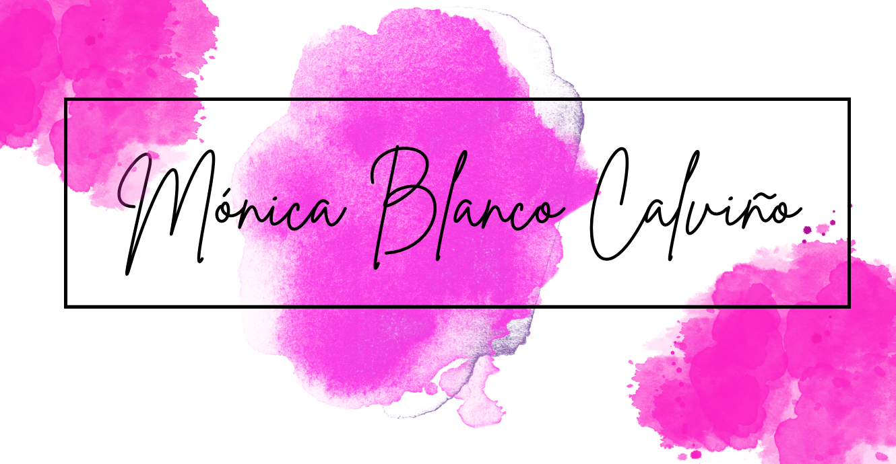

# Sobre mi
Debo decir que disfruto aprendiendo cosas nuevas y no me dan miedo los retos, me considero una persona apasionada del desarrollo web y encuentro gran satisfacción en aprender y crecer todos los días en este apasionante campo. Desde que comencé este viaje he mantenido mi compromiso de crecimiento profesional, explorando y dominando nuevas tecnologías y herramientas en el mundo del desarrollo web. ¡Siempre en busca de nuevos desafíos!

Disfruto de trabajar en equipo y aprender tanto como es posible de cada experiencia y persona con la que me encuentro. Soy una profesional curiosa, comprometida y alegre, es por ello que me encuentro en constante aprendizaje y busco cada día conocer nuevas herramientas que me ayuden a ser mejor profesional. 

Tengo conocimientos de front-end aplicando metodologías ágiles como kanban y scrum y conocimientos de back-end con OOP, desarrollando siempre con principios de código limpio y aplicación de pruebas. 

# Lenguajes y tecnologías:

  

  

#### Actualmente me dedico a:

- Reforzar conocimientos sobre el stack tecnológico MERN y nuevas tecnologías.
- Afianzar e investigar principios, patrones buenas prácticas y metodologías de desarrollo.
- Trabajar como Frontend en aplicaciones web 3D con integración de inteligencia artificial.

<!--  -->

   

 <!--  -->

<!--   -->

<!-- 

 -->

<!--  -->

# Contáctame 

[LinkedIn](https://www.linkedin.com/in/monicablancocalvi%C3%B1o/)

